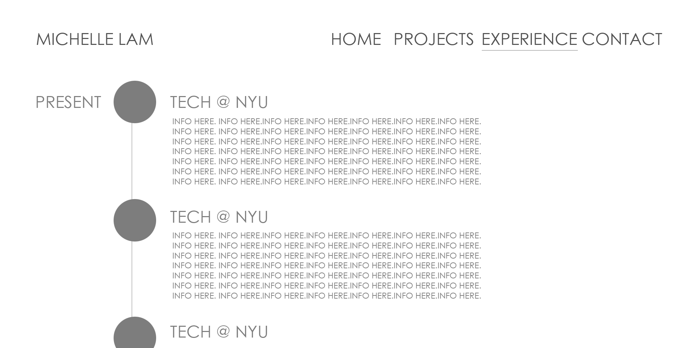

# CONCEPT
I wish to create a portfolio page that accurately displays myself and the work I've done thus far. Ideally it'll showcase both my computer science abilities and my graphic design work accurately in its sleek and simple design.

# SITEMAP

# WIREFRAME

# INSPIRATION
https://www.facebook.com/groups/1487708811477672/
https://www.ryanfitzgerald.ca/
http://hasque.com/
http://pablogarces.me/index.html
http://codepen.io/geeksmarter/full/XpwYQx/
http://championswimmer.in/

# CONCEPT/SKILLS WE COVERED
* Responsive design
* HTML/CSS & Bootstrap

# CONCEPT/SKILLS I NEED TO LEARN
* AngularJS
* Formspree (https://formspree.io/)